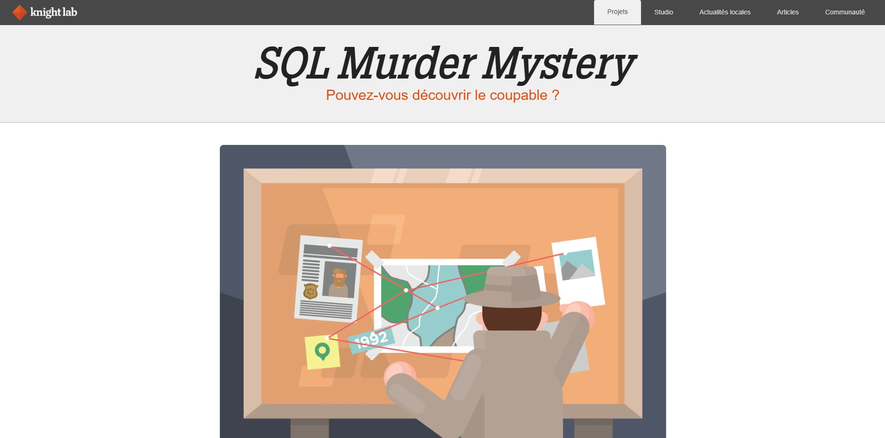

# CTF SQL Murder Mystery

## Présentation du CTF 

SQL Murder Mystery est un jeu d’enquête interactif qui permet d’apprendre et de pratiquer le langage SQL tout en résolvant une affaire de meurtre fictive. À l’aide d’une base de données contenant des témoignages, des personnes, des lieux et différents indices, le joueur doit interroger les données pour retrouver le coupable.

L’objectif est de mener l’enquête à l’aide de requêtes SQL : rechercher des informations, filtrer les résultats, relier plusieurs tables et analyser les données afin de reconstituer les événements et identifier le meurtrier.

Ce projet combine ainsi apprentissage du SQL, logique et résolution d’énigmes, dans un contexte ludique et immersif. Il constitue un excellent exercice pour se familiariser avec des notions essentielles comme SELECT, WHERE, JOIN, ORDER BY, GROUP BY et les sous-requêtes.

Auteurs : Joon Park and Cathy He

Origine : [SQL Murder Mystery](https://mystery.knightlab.com/)

## Aperçu

-----------

## Installation manuel
Vous n'utilisez pas l'application **les CTFs de Cyrhades** ? C'est dommage !
Mais voici comment installer ce CTF manuellement :

> git clone https://github.com/Hack-Oeil/sql-mysteries.git

> cd sql-mysteries 

> docker compose up

